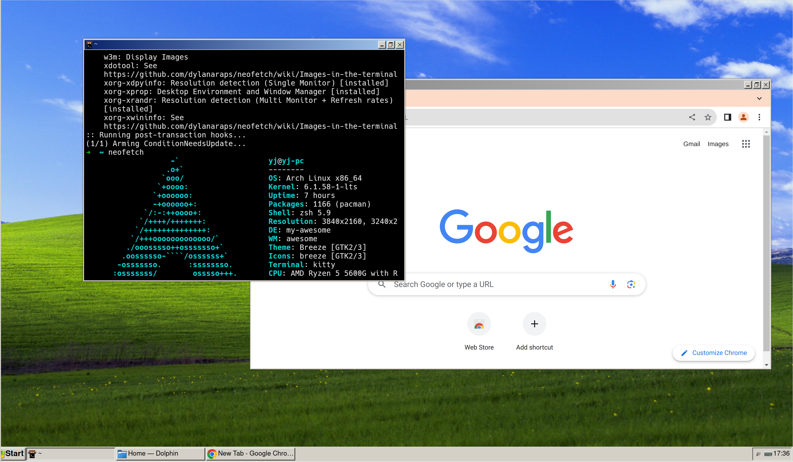

# Features
- Fast focus window (Super + f, Super + h/j/k/l).
- Command panel (like Vscode), used to launch software, manage tags, and some useful commands (Super + p for complete command panel, Super + r for run applications).
- Simulate mouse operations with the keyboard (Super + m).

# Screenshots

**Labelled Windows**


**Floating layout with windows clastic theme**
!

**Command palette**


# Installatoin
## Install lua dependencies

```
luarocks install --local --lua-version 5.3 bjornbytes/rxlua
luarocks install --local --lua-version 5.3 fzy 1.0-1
luarocks install --local --lua-version 5.3 lua-cjson 2.1.0-1
luarocks install --local --lua-version 5.3 luafilesystem 1.8.0
luarocks install --local --lua-version 5.3 penlight 1.12.0-2
luarocks install --local --lua-version 5.3 inspect 3.1.3
luarocks install --local --lua-version 5.3 u-test 1.1.0-0
```

## Install fennel

[fennel](https://fennel-lang.org/setup)

## build fennel
```
./build.fnl
```

## Compositor

[picom](https://github.com/yshui/picom)

## Fonts

[Material icons](https://github.com/google/material-design-icons/blob/master/font/MaterialIconsRound-Regular.otf)

# Reference

[Fennel](https://fennel-lang.org/)
[AwesomeWM](https://awesomewm.org/doc/)

